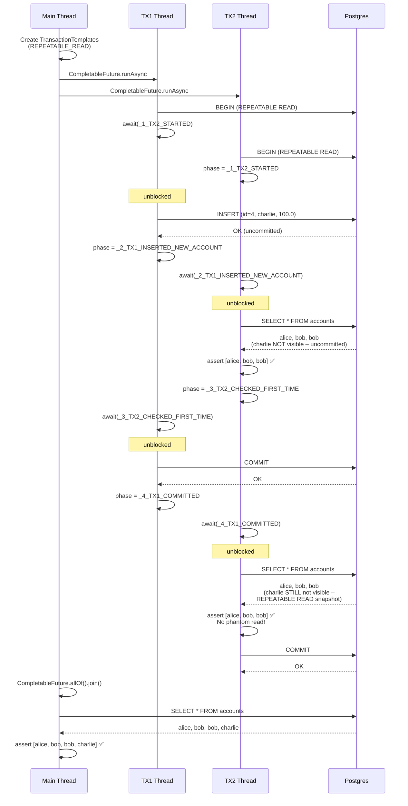

```mermaid
sequenceDiagram
    participant Main as Main Thread
    participant TX1 as TX1 Thread
    participant TX2 as TX2 Thread
    participant PG as Postgres

    Main->>Main: Create TransactionTemplates<br/>(REPEATABLE_READ)
    Main->>TX1: CompletableFuture.runAsync
    Main->>TX2: CompletableFuture.runAsync

    TX1->>PG: BEGIN (REPEATABLE READ)
    TX1->>TX1: await(_1_TX2_STARTED)

    TX2->>PG: BEGIN (REPEATABLE READ)
    TX2->>TX2: phase = _1_TX2_STARTED

    Note over TX1: unblocked

    TX1->>PG: INSERT (id=4, charlie, 100.0)
    PG-->>TX1: OK (uncommitted)
    TX1->>TX1: phase = _2_TX1_INSERTED_NEW_ACCOUNT

    TX2->>TX2: await(_2_TX1_INSERTED_NEW_ACCOUNT)
    Note over TX2: unblocked

    TX2->>PG: SELECT * FROM accounts
    PG-->>TX2: alice, bob, bob<br/>(charlie NOT visible – uncommitted)
    TX2->>TX2: assert [alice, bob, bob] ✅
    TX2->>TX2: phase = _3_TX2_CHECKED_FIRST_TIME

    TX1->>TX1: await(_3_TX2_CHECKED_FIRST_TIME)
    Note over TX1: unblocked
    TX1->>PG: COMMIT
    PG-->>TX1: OK
    TX1->>TX1: phase = _4_TX1_COMMITTED

    TX2->>TX2: await(_4_TX1_COMMITTED)
    Note over TX2: unblocked

    TX2->>PG: SELECT * FROM accounts
    PG-->>TX2: alice, bob, bob<br/>(charlie STILL not visible –<br/>REPEATABLE READ snapshot)
    TX2->>TX2: assert [alice, bob, bob] ✅<br/>No phantom read!
    TX2->>PG: COMMIT
    PG-->>TX2: OK

    Main->>Main: CompletableFuture.allOf().join()
    Main->>PG: SELECT * FROM accounts
    PG-->>Main: alice, bob, bob, charlie
    Main->>Main: assert [alice, bob, bob, charlie] ✅
```